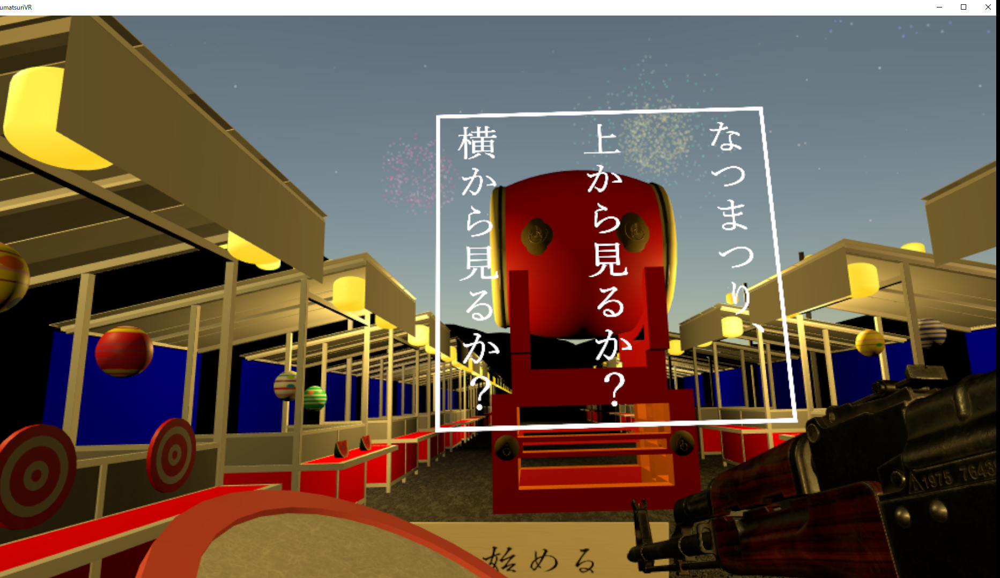
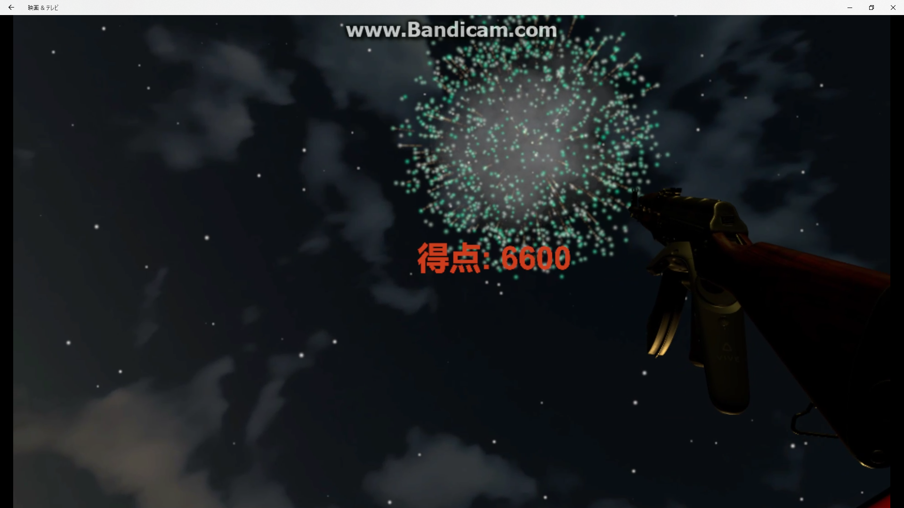
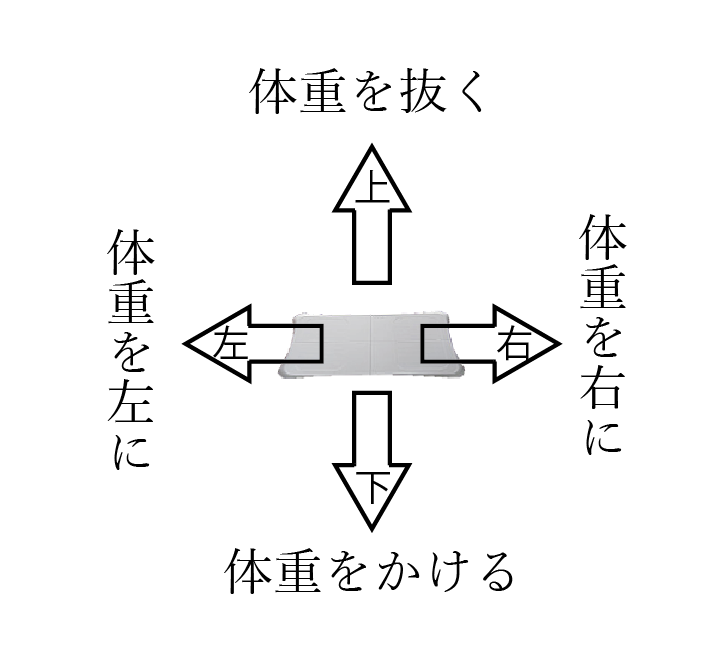

# NatsumatsuriVR

## プレイ動画

## プレイ画面

## 目標

・自分の最近ハマっているVRで、開発の特訓としてPCベースで一つのゲームを完成させたい(開発力を上げて研究に生かしたい)。
・ゲームを作ってみたい。
・夏っぽいコンテンツを作りたい。
・VRでの移動の形式としてあまり注目されないWiiボードを使った移動を実現してみたい。

## 制作進捗

9月がRCA-IISのプロジェクトとゲーム会社でのインターンで忙しくなるため早めに制作を進めています。

ゲームの骨格（ステージ、アセット、動的オブジェクト生成・削除、プレイヤーオブジェクト間インタラクション、スコア記録、シーン遷移）：完成

ゲームバランスの調整：要調整

操作解説UI：必要

得点UIの修正：必要

フレームレート最適化：必要

ゲームの進行に伴うUI表示：必要

VRTKのバグ修正：必要

夏祭りに来ている人々を何かしらで表現したい（がこれ以上動作重くしたくない）

## 概要

ここは花火大会の行われる海沿い。立ち並ぶ屋台に1人で来たあなたの周りはカップルやグループで来てる人たちだらけ…なんだか自分だけ周りから見ると浮いてるみたい…。

そんなことを思っていると、なんと本当に身体が宙に浮いてきた！？

宙に浮き上がってしまったあなたは，花火大会の屋台では定番の金魚すくいや射的，水風船を楽しみつつ、花火の打ちあがる夜の屋台通りの上を飛んでいく。非現実的な体験を通じて、沈んだ心も花火と共に打ち上げよう！！

空を飛びながら、３つのゲームを楽しみましょう。
１. 金魚すくい	・・・飛んでくる金魚を網ですくえ。
２. 射的		・・・出てくる的を銃で打ち抜け。
３. 水風船避け	・・・ヨーヨーを釣るのではない。割らずによけろ。

## 操作説明

### 移動

椅子に座り、足元の魔法の絨毯(wiiボード)へ体重をかけて移動します。

### 屋台の楽しみ方

## 制作環境/プレイ環境

### PC

OS : windows10

プロセッサ : Intel Core i7-7700HQ @ 2.80GHz

GPU : NVIDIA GeForce GTX 1070

RAM : 8GB

Bluetooth接続環境

### ソフトウェア

Unity 2017.1.0f3 Personal

Visual Studio 2017 Community

Blender

SketchUp

### 周辺機器

HTC vive HMD + コントローラー2つ

Balance Wii Board（中古でAmazonにて1500円ほどで動作確認済み品を入手)

ヘッドホン

### WiiBoardのセットアップに関して

http://machinemaker.hatenablog.com/entry/2016/03/12/205040

Unityとの連携はこちらを参考にしました。

windows10のPCへのBluetooth接続に関しては、以下のサイトの追記部分のリンクからダウンロードできるwin8.1向けにコンパイル済みのwiipermpair2を用い接続に成功しました。

http://tyche.pu-toyama.ac.jp/~a-urasim/wiimote/
